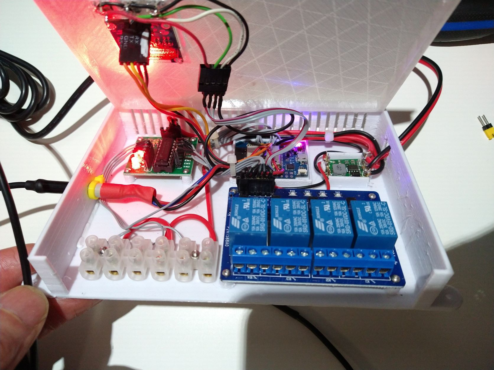
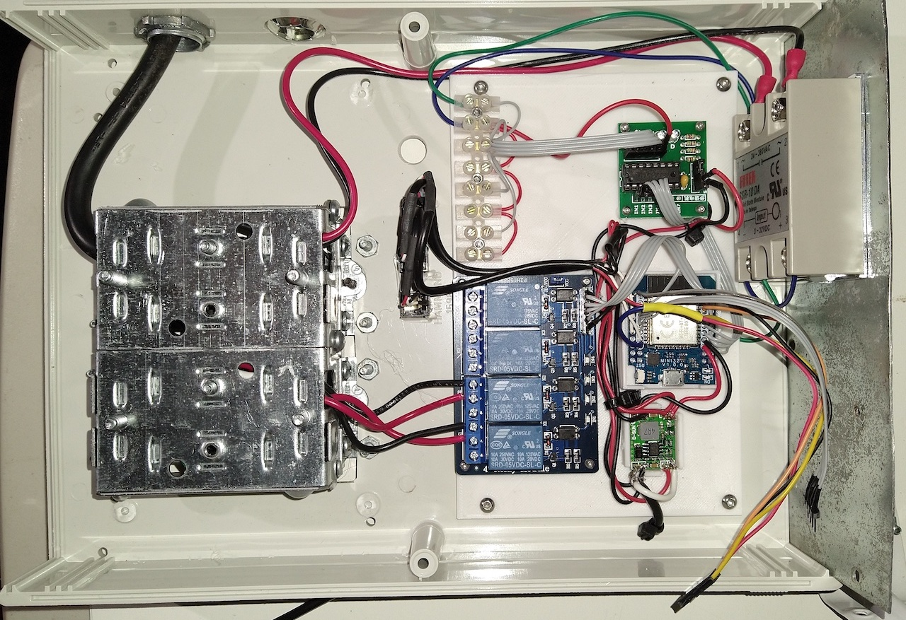

# microserre

Asservissement de serre intérieure en utilisant un esp32 avec Tasmota et le script Berry 
Micro-greenhouse control  using  esp32 on tasmota and berry script.

<b>Update Version 2.0</b>
<ul><li>Ajout d'une pompe pour la tour hydroponique Hydroponic Tower pump add-on</li>
<li>Ajout d'une classe pour gérer l'écran OLED sous plusieurs classes Class AllScreens to deal with multiple modules</li>
<li>Ajout de configuration dans le WEB GUI de tasmota.  Web Gui Configuration for PID heater and Hydroponic pump</li>
<li>Tout les paramètres sont maintenant sauvegardés d'une façon permanente avec la classe persist All parameters are stored into persist</li>
</ul>
N.B. Il faut absolument utiliser <a href="https://ota.tasmota.com/tasmota32/release/tasmota32-display.bin">tasmota version 13 ou plus avec display.</a> &nbsp;&nbsp;&nbsp;&nbsp;&nbsp;You need at least tasmota ESP32 with display version 13 minimum  

Modules
<ul><li>MyKeys.be&nbsp;&nbsp;&nbsp;&nbsp;&nbsp;&nbsp;&nbsp;&nbsp;&nbsp;&nbsp;&nbsp;&nbsp;&nbsp;&nbsp;&nbsp;classe clavier (keyboard)</li>
<li>AllScreens.be&nbsp;&nbsp;&nbsp;&nbsp;&nbsp&nbsp;&nbsp;&nbsp;&nbsp;&nbsp;classe écran SSD1306 (oled screen)</li>
<li>HeaterPWM.be&nbsp;&nbsp;&nbsp;&nbsp;&nbsp;&nbsp;&nbsp;&nbsp;classe de gestion du chauffage PID (PID heater)</li>
<li>HeaterPWM_UI.be&nbsp;&nbsp;&nbsp;classe de configuration du PID (PID tasmota web Configuration</li>
<li>HydroCycle.be&nbsp;&nbsp;&nbsp;&nbsp;&nbsp;&nbsp;&nbsp;&nbsp;&nbsp;&nbsp;class de gestion de la pompe (hydroponic pump)</li>
<li>HydroCycle_ui.be&nbsp;&nbsp;&nbsp;&nbsp;&nbsp;class de configuration de la pompe (hydroponic pump tasmota web configuration)</li>
<li>autoexec.be&nbsp;&nbsp;&nbsp;&nbsp;&nbsp;&nbsp;&nbsp;&nbsp;&nbsp;&nbsp;&nbsp;&nbsp;&nbsp;&nbsp;&nbsp;premier module chargé par tasmota. (first module to be loaded),
 </ul>
 

Vidéos youtube à propos du montage 
Youtube video about it.  ( they are in french!)  
*** update pour tasmota 14+ utiliser la version écran universel 
&nbsp;&nbsp;&nbsp;For tasmota 14+  use the universal display 
&nbsp;&nbsp;&nbsp;https://tasmota.github.io/docs/Universal-Display-Driver/ 

<ul><li>Partie 1 https://www.youtube.com/watch?v=mvLWmBBGy5E</li>
<li>Partie2 https://www.youtube.com/watch?v=h-Z3mEz7BCM</li></ul>

Liens utile: (links)
<ul><li>https://tasmota.github.io/docs/</li>
<li>https://templates.blakadder.com/wemos_D1_Mini_ESP32.html</li></ul>

Pour la tour Hydroponique 
Hydroponic tower links 
<ul><li>https://www.youtube.com/watch?v=5VMlcasPe9M</li>
</ul>

Les pièces que j'ai utilisé. Le tout est disponible sur amazon (Part list)
<ul><li>LEGOO Module relais 4 canaux DC 5 V pour arduino et Pi</li>
<li>KeeYees mini 32 cartes d'extension ESP32 WiFi</li>
<li>Barrina Lot de 4 lampes de croissance à DEL de 6 m,4 x 24 W</li>
<li>Inkbird Relais SSD 25DA</li> 
<li>Ventilateur de PC 12V</li>
<li>IZOKEE I2C IIC 12864 128 x 64 pixels Écran LCD OLED Module SSD1306</li>
<li>Boîtier Hammond 1598j</li>
<li><a href="https://www.amazon.ca/-/fr/gp/product/B0B4NZXBR6d">pompe d'aquarium</a></li></ul>

Et provenant d'un magasin de rénovation (Home hardware stuff)
<ul><li>Boîte électrique</li>
<li>prise électrique</li>
<li>J'ai modifié une chaufferette électrique de 1500W provenant de walmart. 
L'élement céramique avec résistances en parallèle  déplacé en série. 
De cette façon la puissance maximal est d'environ 200W. 
Et l'ajout de la connection du relais SSR entre l'élément et le contrôle.</li></ul>

3D printer STL 
*** Les STL sont dans le github
<ul><li>Guide de monter et de descente pour les lumières.  https://www.tinkercad.com/things/bOlsN8ecEKT-autolockserrebracket</li>
<li>Base du boîtier électronique. A besoin de modification pour élever le esp32. https://www.tinkercad.com/things/02fj1fIYesj-serrre-relay-box </li>
<li>Couvercle du boîtier électronique. https://www.tinkercad.com/things/dSbcd1Je0ZF-serre-relay-box-cover</li></ul>

Pour le boîtier Hammond 1598J
<ul><li>Plaque de base pour l'électronique.   https://www.tinkercad.com/things/1p8VonWZfnd-plaquebaseserrehammondbox</li>
<li>Facette (cadre) pour sdd1306  https://www.tinkercad.com/things/dEeSKWZAIZZ-serreoled1306bezel </li></ul>
